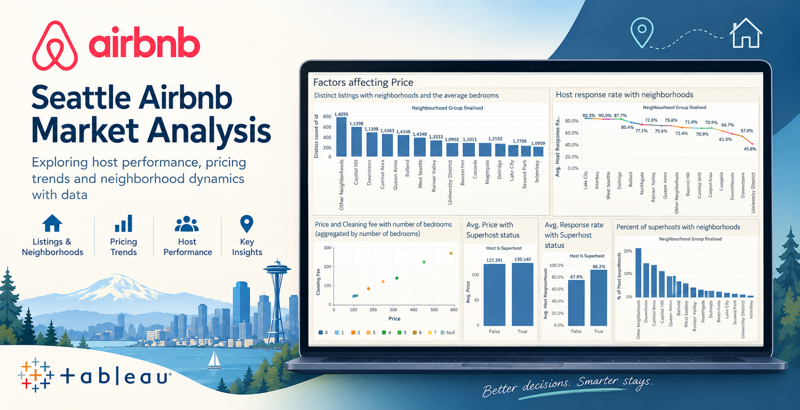

# Seattle Airbnb Market Analysis

Tableau dashboard exploring host performance, pricing trends, and neighborhood dynamics in the Seattle Airbnb market.

## Overview

This project analyzes listing-level Airbnb data for Seattle to understand what actually drives price and host quality signals at the neighborhood level — and, just as importantly, what doesn't.

## Key Insights

- **Superhost status barely moves price, but strongly predicts response rate.** Average price is nearly flat across superhost status (\$127.39 for non-superhosts vs. \$130.14 for superhosts, a ~2% difference), while average host response rate differs sharply (67.8% vs. 86.2%, an ~18-point gap). This is consistent with response rate being one of Airbnb's actual criteria for superhost status, rather than superhost status being a general marker of a "better" or pricier listing.
- **Property size, not host-quality metrics, explains Magnolia's high prices.** Magnolia has the highest average price of any Seattle neighborhood despite a below-average superhost percentage and a below-average host response rate. Magnolia also has the highest average number of bedrooms among all neighborhoods, suggesting property size is the stronger driver of price here.
- **Downtown leads on superhost concentration and price.** Downtown has the highest percentage of superhosts of any neighborhood and ranks 3rd on average price.
- **Response rate and affordability often go together.** Lake City has both the best average host response rate and a below-median price. Lake City, Interbay, West Seattle, and Delridge form a cluster of similarly high response rates, and three of the four (Interbay, Lake City, Delridge) also fall in the cheaper half of listings by price.
- **Price and cleaning fee both rise with bedroom count.** Aggregating listings by number of bedrooms shows a clear upward trend in both average price and average cleaning fee as bedroom count increases.

## Dashboard Contents

- Distinct listing count by neighborhood, with average bedroom count labeled per bar
- Average host response rate by neighborhood
- Price and cleaning fee vs. number of bedrooms (aggregated scatter plot)
- Average price by superhost status
- Average host response rate by superhost status
- Percent of total superhosts by neighborhood

## Tools

- Tableau (Desktop / Public)

## Dataset

This project uses the [Seattle Airbnb Open Data](https://www.kaggle.com/datasets/adriangonzalezcortes/seattle-airbnb-dataset) dataset from Kaggle. The raw dataset is not included in this repository due to its size — download it from the link above to reproduce the analysis.

## Files

- `Seattle Airbnb Dataset Analysis.twbx` — Tableau packaged workbook
- `Seattle AirBnB analysis.png` — Dashboard screenshot
- `AirBNB_cover.png` — Cover image

## Author

**Saunav Kaushik**
[LinkedIn](https://www.linkedin.com/in/saunav-kaushik-29296320b/) · [GitHub](https://github.com/saunavkaushik) · [Portfolio](https://saunavkaushik.github.io)
